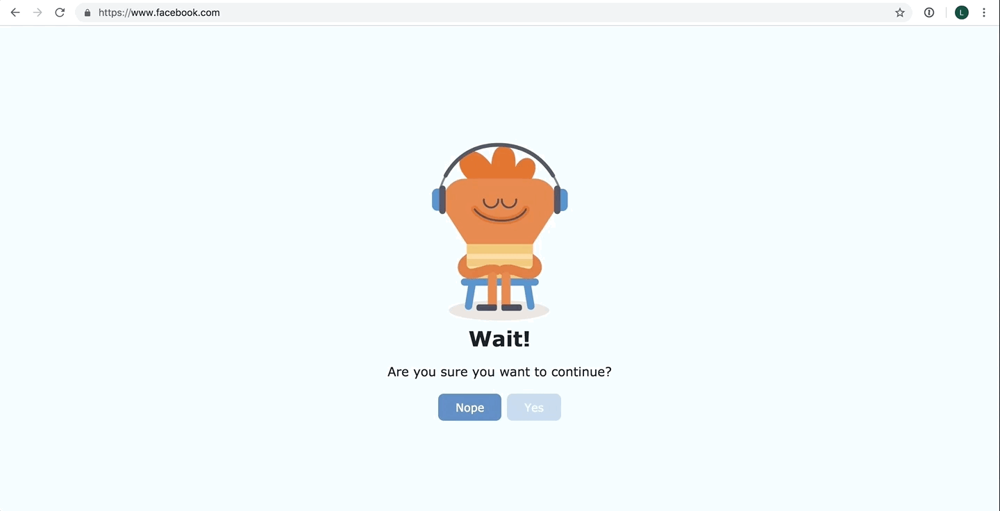
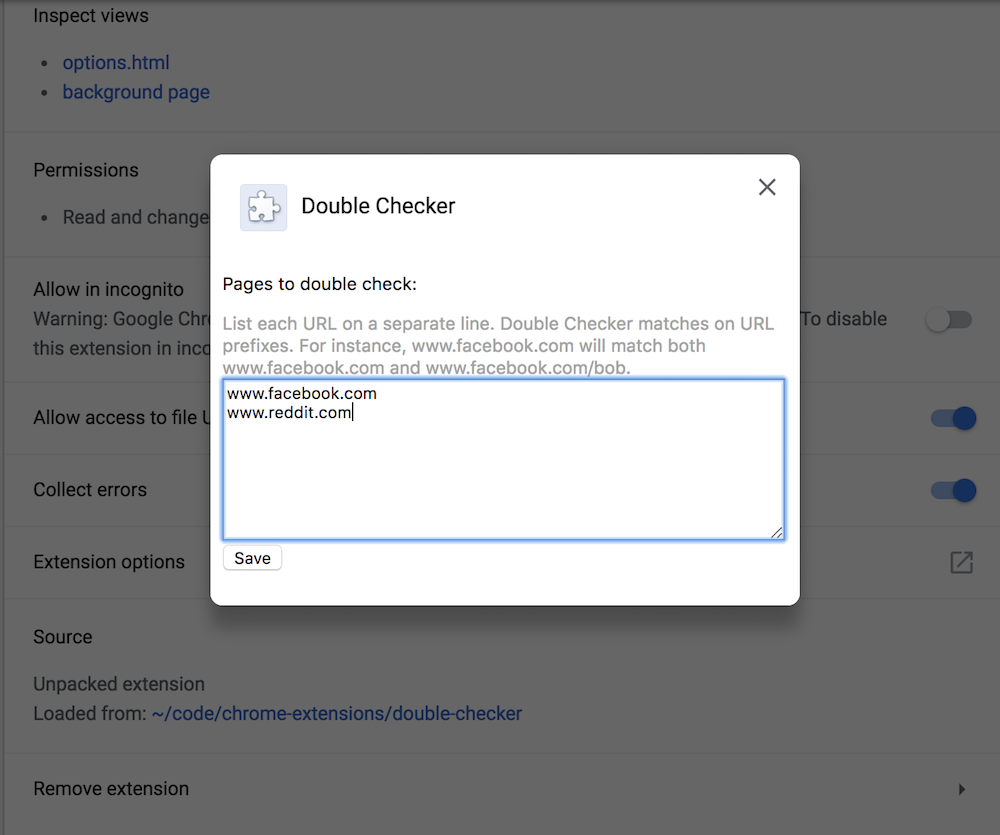

# Double Checker
Double Checker is a chrome extension that helps you change bad habits.

Do you also have sites that you visit simply by routine when opening a new tab?
Double Checker gives you a chance to change your mind before you get caught in
your favorite corners of the deep dark interwebs.

## Usage
When navigating to your blacklisted sites, you'll get a chance to decide if you
really want to continue:

Change the blacklisted sites in the extension's settings page:

## TODO:
* Make popup load faster.
* Hide the parent page before the popup shows up (but don't affect pages that are not on the blacklist).
* Shield the popup from the parent page's CSS. This should probably be done with a shadow DOM.
